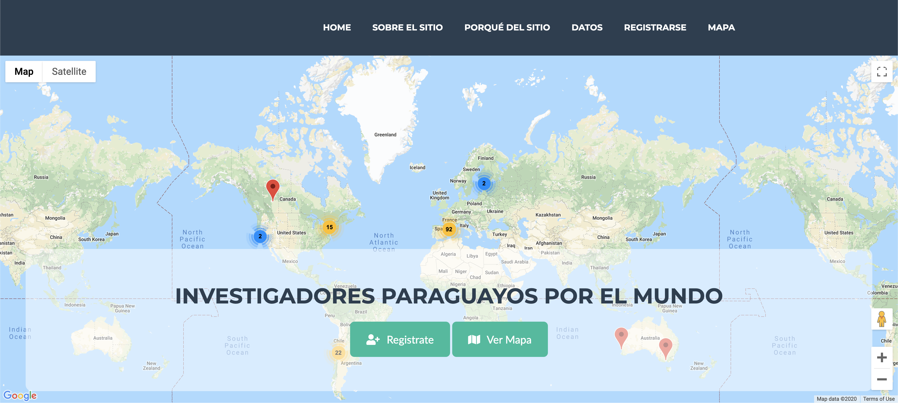
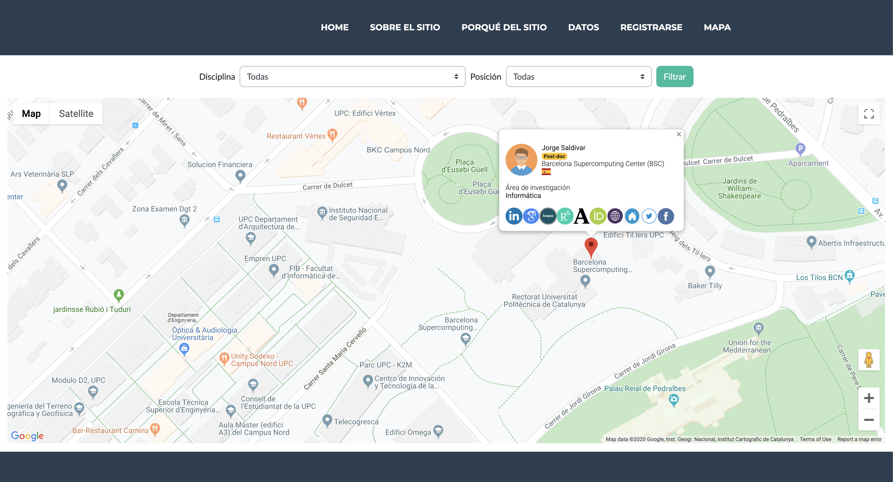

# CIPE
CIPE is a website that visualizes information of Paraguayan researchers living 
abroad and working in academia. The website shows the name, field of expertise, position 
(i.e., PhD student, postdoc, professor), and location of Paraguayans who are residing and doing 
academic research in universities, research centers, and companies abroad.

## Screenshots

## Installation

0. For the impatient: The only key you need to get a **really quick start**, is a valid Google Map API KEY, all the others default credentials will be used. However your are encouraged to complete the setup process if your planning to use this proyect in the long run.
1. Install docker and docker-compose in your local machine. Check the official installation [guidelines](https://docs.docker.com/install/); 
2. Obtain a google maps api key by following the instructions [here](https://developers.google.com/maps/documentation/embed/get-api-key);
3. Clone the repository `git clone https://github.com/joausaga/cipe.git`;
4. Get into the directory `cipe`;
4. Run `scripts/prepare-config-templates.sh`
5. Set the configuration parameters of the database in `.env.prod.db`;
6. Set the SECRET_KEY and GOOGLE_MAPS_API_KEY obtained before as well as the configuration parameters 
of the database in `.env.prod`;
7. Build docker container `docker-compose -f docker-compose.prod.yml up --build -d` ,
Once containers are fully created, you can watch the logs with `docker-compose -f docker-compose.prod.yml logs -f` , to see for the containers to be fully initialized;
8. Load initial data `docker-compose -f docker-compose.prod.yml exec app python manage.py loaddata data/initial_data.json`;
9. Go to `http://localhost:1550` to access the tool

## Cleanup/reinitialize

1. `scripts/cleanup-containers.sh` will help you to restore to its ground zero in case you need to reinitialize the whole process. You are warned that this is a DESTRUCTIVE operation, you WILL lose data generated by normal cipe usage.

## Initial data

The website was initially preloaded with data of BECAL fellows obtained through [this request](https://informacionpublica.paraguay.gov.py/portal/#!/ciudadano/solicitud/24586) 
for  accessing public information about the [BECAL](http://www.becal.gov.py/) fellowship program.

## Technologies

1. [Python 3.6](https://www.python.org/downloads/)
2. [MySQL Community Server](https://www.mysql.com/downloads/)
3. [Django 2.2](https://www.djangoproject.com)
4. Google Maps

## Issues

Please use [Github's issue tracker](https://github.com/joausaga/cipe/issues/new) to report issues and 
suggestions.
